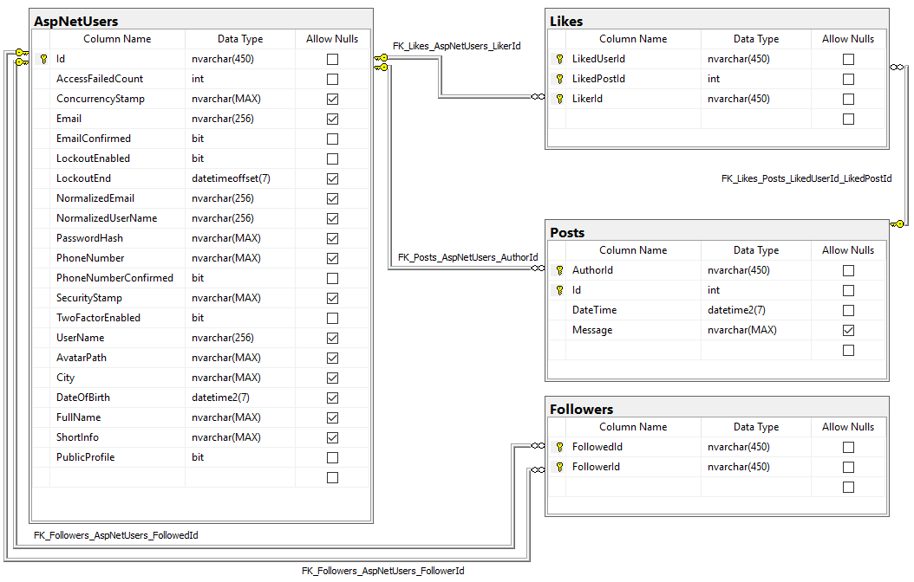

# PlatBlogs

### DISCLAIMER: This is coursework on the subject DBMS so the most part of queries is a raw SQL

## What is this?  
This is a small twitter-like social network with different features such as:  
- Registration with email confirmation  
- Password reset  
- Profiles with full name, nickname, avatar, city, date of birth and short info  
- Public and private profiles. Private user's posts are visible only to the his followings  
- Profile settings with password reset  
- Followings  
- Likes  
- Newsletter  
- Popular posts  
- Pagination for all mentioned sets of posts and users  

## How is it implemented on the database layer?  
The model for this project is not so complex - it only contatins user, post, like and following. User is a default ASP.NET Core user with additional fields. Following is just a table with two columns - followed and follower IDs. Post contains author ID and unique post ID for each author. Like just references liked post and liker.  
Additionally, there are two stored procedures: 
- ```NewPost``` creates new post from its parameters with new unique ID of post for concrete author
- ```GetUserLeftMenuInfo``` extracts info from different tables for user view in the left menu of website  

Whole database diagram:  



## How is it implemented on the server side?  
This application is implemented as ASP.NET Core 2.0 project with MS SQL Server database. Trivial pages such as registration, login, account preferences are implemented with use of default ASP.NET template with minimal changes to satisfy user model requirements such as username or date of birth validation. User avatars are stored in ```wwwrot/avatars/``` folder and links to them are stored in database.  

The most interesting part of the work was to implement multiple similar pages with pagination. Noteworthy, these pages must correctly work with and without javascript (ajax). Special base controller ```OffsetCountBaseController``` was created for these purposes. It contains two methods ```Get``` and ```Post``` that are called for get and post requests from the derived controllers. These methods contains logic to resolve offset+count of objects for pagination and fill view contents. Data is provided by ```itemsLoader``` delegate passed as a parameter.  

View models ```UserViewModel``` and ```PostViewModel``` implements ```IRenderable``` so they can be rendered by single view for list of objects. 

All page-scecific logic is implemented inside the special controller. Basically, it contains queries to the database with some joins, ordering and filters. To avoid SQL code repeating, some common parts were moved to ```QueryBuildHelpers``` helper class.  

Also there is one special controller - ```ApiController```. It contains logic for small api calls such as likes and followings and returns JSON result so it will be ugly to use it without javascript. It's the bottleneck of this architecture that can be fixed in the following releases.  

Email confirmation is implemented as simple SMTP client that sends messages from your account. To use it you must provide your SMTP server and login info in app secrets in the following format:  
```  
"email": {  
  "Server": xxx,   // "smtp.server.com"  
  "Port": xxx,     // 25  
  "Username": xxx, // "username"  
  "Password": xxx, // "password"  
  "From": xxx      // "username@server.com"  
}  
```

## How is it implemented on the client side?  
On the client side results are presented as adaptive [bootstrap](https://getbootstrap.com/) website with ajax request for posts/users loading and likes/followings.  
Single **Follow** form ```#follow-form``` is altered to load results dynamically and change user's followers count in the block ```#followers-count```  
**Like** buttons ```.post-like-form``` are altered to load results dynamically and change likes count and like button style  
**Load more** buttons ```.load-more-form``` are altered to send POST request instead of default GET. After success clicked button is replaced with loaded results  